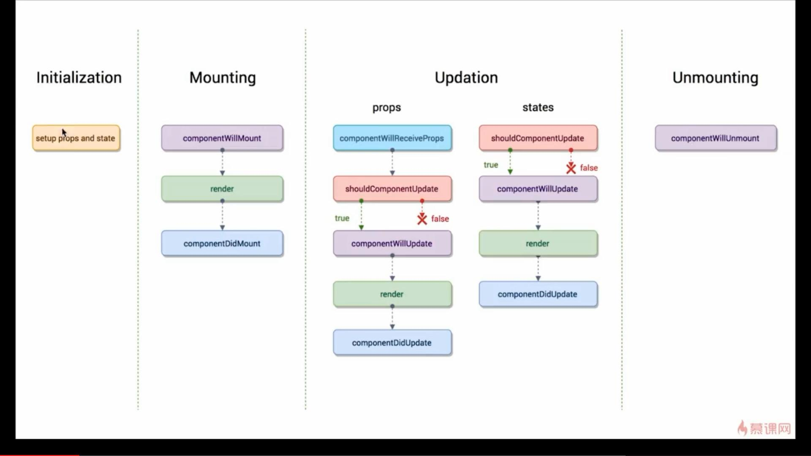

## React学习笔记

### 生命周期函数

#### initialization
##### 组件初始化，执行Constructor，初始state和props

#### componentWillMount
##### 当组件即将被挂载到页面时自动执行

#### render
##### 渲染组件

#### componentDidMount
##### 组件被挂载到页面之后，自动执行

#### componentWillReceiveProps

#### shouldComponentUpdate
##### 组件被更新之前会被执行，返回false时，组件不会被更新
